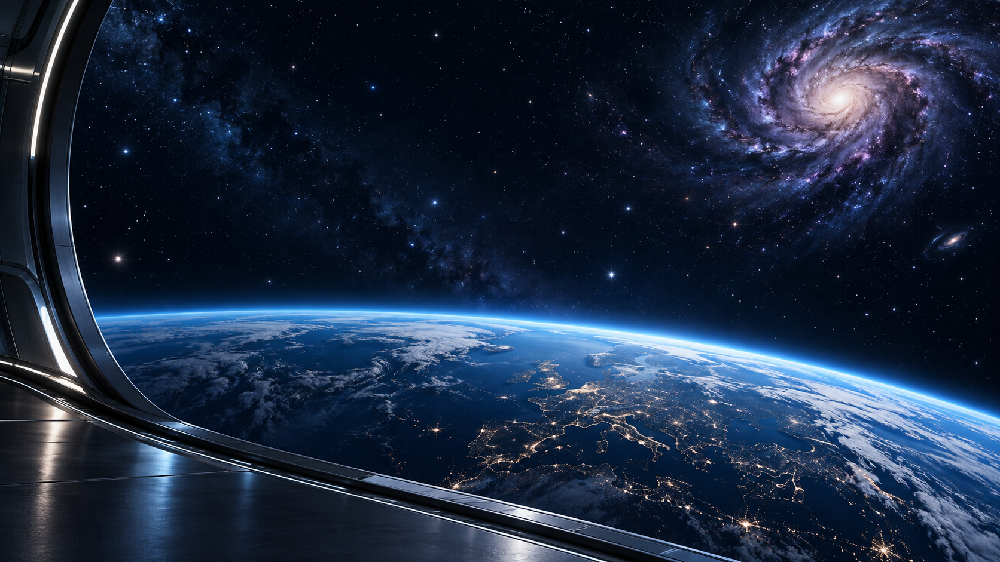

# Odyssey for Omarchy

A space-inspired dark theme by Doc @ GP Tech: midnight navy surfaces, electric cyan and violet accents, and an original Earth-orbit wallpaper.



## Compatibility

Developed on **Omarchy 4.0.3-1**, using its Lua Hyprland configuration, colors.toml theme system, and Quickshell shell. Older Waybar-based versions are not supported. Other versions and hardware have not been tested.

## Standard installation

```bash
omarchy theme install https://github.com/docintherock-boop/omarchy-odyssey-theme.git
```

This installs the palette, wallpaper and shell surface colors. Omarchy intentionally ignores `hyprland.lua` from repository-installed themes; your existing window geometry remains in effect. Back up an existing custom theme named `odyssey` before installing: Omarchy replaces matching theme folders.

## Optional rounded glass window style

For 16px rounded corners, three-color borders, wider gaps, blur and soft cyan shadows, clone the repository, **review `install-glass.sh` and `hyprland.lua`**, then run the local installer:

```bash
git clone https://github.com/docintherock-boop/omarchy-odyssey-theme.git
cd omarchy-odyssey-theme
bash install-glass.sh
```

This explicit local installation creates a separate `odyssey-glass` theme, without changing Omarchy's repository-install filtering. The script backs up an existing `odyssey-glass` folder before replacing it. It needs no sudo, does not edit packaged Omarchy files, and applies the theme with Omarchy's own command. Personal look-and-feel overrides may take precedence.

To return to another theme:

```bash
omarchy theme set "YOUR PREVIOUS THEME"
```

To uninstall, select another theme first, then remove the `odyssey` and/or `odyssey-glass` folders you installed from `~/.config/omarchy/themes/`. Keep any backups until you no longer need them.

## Optional dock

The [Odyssey Recent Apps Dock](https://github.com/docintherock-boop/omarchy-odyssey-dock) is a separate plugin. It works with this theme or on its own.

## Artwork and scope

Wallpaper generated using OpenAI's built-in image-generation tool for this project. The inspirational mockups are not included. Wallpaper preview above is artwork; it does not depict functional desktop widgets. The theme does not include the fictional dashboard, sculpted liquid-glass frames, or an icon pack.

The code and configuration are provided under the MIT license. The generated wallpaper is included under the same permission terms to the extent applicable rights exist; no exclusive copyright claim is made over AI-generated elements. Application icons belong to their respective projects.
